# Github Actions

In this project i created a simple PHP, MYSQL Contacts Management PHP web application using Docker and Docker Compose for understanding of CI/CD pipelines and Github Actions, which is used to automate the development (build, test & deployment) process of software application.

First of all we do the coding part.

# Contacts Management PHP Script

This PHP script is designed to facilitate the management of a simple contacts list stored in a MySQL database. It provides basic functionalities such as adding new contacts, deleting individual contacts, and deleting all contacts.

## Features

### 1. Database Connection
   - Establishes a connection to a MySQL database using provided credentials.

   ```php
   $servername = "192.168.100.4"; // Docker service name. 
// when running from docker compose use your db service name "db" from docker-compose file.
   $username = "rehan"; // MySQL your own username. 
// username must be same used in mysql.sql file . When running from docker compose use root user.
   $password = "your_password";
   $dbname = "mydatabase";

   // Create connection
   $conn = new mysqli($servername, $username, $password, $dbname);

   // Check connection
   if ($conn->connect_error) {
       die("Connection failed: " . $conn->connect_error);
   }
```


### 2. Form Handling

   - Handles form submissions for adding, deleting individual, and deleting all contacts.
```php
// Handle form submissions
if ($_SERVER["REQUEST_METHOD"] == "POST") {
    // Add new entry
    if (isset($_POST["add"])) {
        // ...
    }

    // Delete entry
    if (isset($_POST["delete"])) {
        // ...
    }

    // Delete all entries
    if (isset($_POST["deleteAll"])) {
        // ...
    }
}
```
### 3. Table Creation
Checks if the "users" table exists and creates it if not, using SQL statements from "mysql.sql."
```php
// Load and execute SQL file only if the users table doesn't exist
$tableCheckQuery = "SHOW TABLES LIKE 'users'";
$tableCheckResult = $conn->query($tableCheckQuery);

if ($tableCheckResult->num_rows == 0) {
    // Load and execute SQL file
    $sqlFile = 'mysql.sql';
    $sqlContent = file_get_contents($sqlFile);

    // Execute SQL statements
    if ($conn->multi_query($sqlContent)) {
        do {
            // Consume all results
        } while ($conn->next_result());
    } else {
        echo "Error executing SQL file: " . $conn->error;
    }
}
```
### 4. Data Retrieval and Display
Retrieves all records from the "users" table and displays them in an HTML table.
```php
// Fetch users from the database
$sql = "SELECT * FROM users";
$result = $conn->query($sql);

// Display users in a styled HTML table
if ($result) {
    if ($result->num_rows > 0) {
        // ...
    } else {
        echo "0 results";
    }
} else {
    echo "Error fetching users: " . $conn->error;
}
```
### 5. HTML Styling
Generates styled HTML for better presentation.
```html
<html lang='en'>
<head>
    <!-- ... -->
    <style>
        /* ... */
    </style>
</head>
<body>
    <!-- ... -->
</body>
</html>
```
### 6. Forms for User Interaction
- Add New Entry" form allows users to input name, email, and contact number.
- Delete All Entries" form includes a button to delete all records from the "users" table.
```html
<!-- Add new entry form -->
<form method='post' action=''>
    <!-- ... -->
</form>

<!-- Delete all entries form -->
<form method='post' action=''>
    <!-- ... -->
</form>
```
## Usage

1. Database Configuration:
Modify `$servername`, `$username`, `$password`, and `$dbname` in the script according to your MySQL database configuration.
2. Running the Script:
Deploy the script on a server with PHP and access it through a web browser.
3. Security Considerations:
Please implement additional security measures, such as input validation and prepared statements, to protect against SQL injection which is missing in this code.

### File Descriptions
- mysql.sql<br>Contains SQL statements for creating the "users" table.
- index.php<br>
The main PHP script for managing contacts.

### Dependencies

- PHP
- MySQL

# Create Docker Files

## For Web Server
- Dockerfile
    - Filename: Dockerfile
```yml
   FROM php:7.4-apache

   COPY index.php /var/www/html/

   RUN docker-php-ext-install mysqli

   EXPOSE 80
```
In above Dockerfile i am setting up a basic PHP environment with Apache, copying an index.php file into the web server's HTML directory, installing the MySQLi extension for PHP, and exposing port 80. Below is a breakdown of each instruction:

- `FROM php:7.4-apache` 
    - Uses the official PHP 7.4 image with Apache as the base image.
- `COPY index.php /var/www/html/`
    - Copies the index.php file into the /var/www/html/ directory inside the Docker container.
- `RUN docker-php-ext-install mysqli`
    - Installs the MySQLi extension for PHP within the Docker image.
- `EXPOSE 80`
    - Exposes port 80 to allow external connections to the Apache web server.

This Dockerfile is suitable for running a PHP application with Apache that uses the MySQLi extension. You can build a Docker image using this file, and when a container is started from that image, it will have an Apache web server running with PHP support and the MySQLi extension installed.
## For Database
- Dockerfile
    - Filename: Dockerfile-sql
```yml
FROM mysql:latest

COPY mysql.sql /docker-entrypoint-initdb.d/mysql.sql

 ENV MYSQL_ROOT_PASSWORD your_password
 ENV MYSQL_DATABASE mydatabase

EXPOSE 3306

CMD  ["--default-authentication-plugin=mysql_native_password"]
```
In above i sets up a MySQL database server, which initializes a database using an SQL script, and exposes port 3306. Below is a breakdown of each instruction:

- `FROM mysql:latest`
    - Uses the official MySQL image with the latest version as the base image.
- `COPY mysql.sql /docker-entrypoint-initdb.d/mysql.sql`
    - Copies the mysql.sql script into the /docker-entrypoint-initdb.d/ directory inside the Docker container.
    - Scripts in this directory are automatically executed when the MySQL container is started, initializing the database.
- `ENV MYSQL_ROOT_PASSWORD your_password`
    - Sets the root password for the MySQL server.
- `ENV MYSQL_DATABASE mydatabase`
    - Specifies the name of the initial MySQL database to be created.
- `EXPOSE 3306`
    - Exposes port 3306 to allow external connections to the MySQL database server.
- `CMD ["--default-authentication-plugin=mysql_native_password"]`
    - Specifies a default authentication plugin for MySQL. In this case, it uses the mysql_native_password plugin.

This Dockerfile is suitable for running a MySQL server with a pre-initialized database. When you build an image from this Dockerfile and run a container, the MySQL server will start with the specified root password, create the specified database, and execute the SQL script to initialize the database.

# Build Docker Images

## For Web Server
- For web server we will use dockerfile of web server `Dockerfile` for building docker image using below command.

```bash
docker build . -t web-server
```
It will build docker image with name `web-server` you can see below logs.

This command includes:

- -t web-server: Tags the image with the name "web-server."
- . : Specifies the build context, indicating that the Dockerfile is in the current directory.
Make sure that you have a Dockerfile in the current directory or provide the correct path to the Dockerfile if it is located in a different directory. The command assumes that the Dockerfile is named "Dockerfile" unless a different filename is specified. If your Dockerfile has a different name, you can use the -f option to specify the filename:

```bash
docker build -t web-server -f Dockerfile-custom .
```
Replace "Dockerfile-custom" with the actual filename of your Dockerfile if it's different.

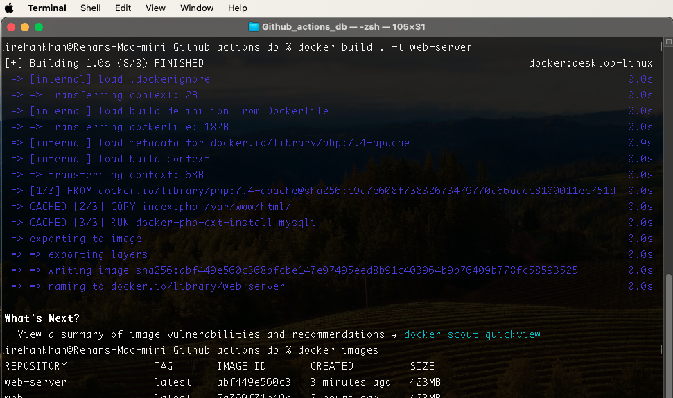

## For Database
- For Database we will use dockerfile of database `Dockerfile-sql` for building docker image using below command.

```bash
docker build . -t web-db
```
This command specifies the following:

- -t web-db: Tags the image with the name "web-db."
- -f Dockerfile-sql: Specifies the path to the Dockerfile, in this case, it's "Dockerfile-sql."
- . : Specifies the build context, indicating that the Dockerfile is in the current directory.

Make sure that your MySQL-related files, such as "mysql.sql" or any other files needed for initialization, are in the same directory as the Dockerfile. Adjust the file paths accordingly if they are in a different location.

It will build docker image with name `web-db` you can see below logs.

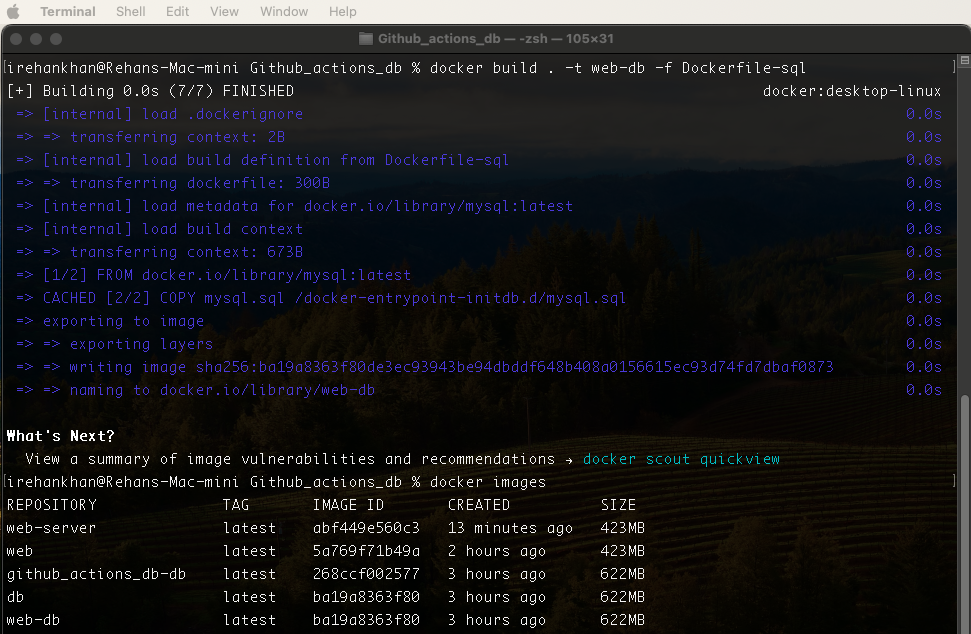

# RUN Docker Containers for above images
## For Database
- First we have to run database container using below command.

```bash
docker run -p 3306:3306 --name web_db_container web-db
```
This command includes:

- -p 3306:3306: Maps port 3306 on the host to port 3306 in the container. This is necessary for allowing connections to the MySQL database.
- --name web_db_container: Specifies the name `web_db_container` for the running container.
- web-db: Specifies the name of the Docker image from which to create the container.
- You can run this container in detached mode using `-d` option in above command.

Make sure that the "`web-db`" image has been successfully built before running this command. If you encounter any issues, you might want to check the Docker build output for any errors or warnings. Additionally, ensure that the necessary MySQL files and configurations are set up correctly in your "web-db" image. Below are complete logs of running container.

```bash
irehankhan@Rehans-Mac-mini Github_actions_db % docker run -p 3306:3306 --name web_db_container web-db 
2023-11-17 15:50:51+00:00 [Note] [Entrypoint]: Entrypoint script for MySQL Server 8.2.0-1.el8 started.
2023-11-17 15:50:51+00:00 [Note] [Entrypoint]: Switching to dedicated user 'mysql'
2023-11-17 15:50:51+00:00 [Note] [Entrypoint]: Entrypoint script for MySQL Server 8.2.0-1.el8 started.
2023-11-17 15:50:51+00:00 [Note] [Entrypoint]: Initializing database files
2023-11-17T15:50:51.438169Z 0 [System] [MY-015017] [Server] MySQL Server Initialization - start.
2023-11-17T15:50:51.438957Z 0 [Warning] [MY-011068] [Server] The syntax '--skip-host-cache' is deprecated and will be removed in a future release. Please use SET GLOBAL host_cache_size=0 instead.
2023-11-17T15:50:51.438997Z 0 [Warning] [MY-010918] [Server] 'default_authentication_plugin' is deprecated and will be removed in a future release. Please use authentication_policy instead.
2023-11-17T15:50:51.439006Z 0 [System] [MY-013169] [Server] /usr/sbin/mysqld (mysqld 8.2.0) initializing of server in progress as process 80
2023-11-17T15:50:51.443165Z 1 [System] [MY-013576] [InnoDB] InnoDB initialization has started.
2023-11-17T15:50:51.566164Z 1 [System] [MY-013577] [InnoDB] InnoDB initialization has ended.
2023-11-17T15:50:52.006347Z 6 [Warning] [MY-010453] [Server] root@localhost is created with an empty password ! Please consider switching off the --initialize-insecure option.
2023-11-17T15:50:52.076519Z 6 [Warning] [MY-013360] [Server] Plugin mysql_native_password reported: ''mysql_native_password' is deprecated and will be removed in a future release. Please use caching_sha2_password instead'
2023-11-17T15:50:53.560140Z 0 [System] [MY-015018] [Server] MySQL Server Initialization - end.
2023-11-17 15:50:53+00:00 [Note] [Entrypoint]: Database files initialized
2023-11-17 15:50:53+00:00 [Note] [Entrypoint]: Starting temporary server
2023-11-17T15:50:53.599839Z 0 [System] [MY-015015] [Server] MySQL Server - start.
2023-11-17T15:50:53.740460Z 0 [Warning] [MY-011068] [Server] The syntax '--skip-host-cache' is deprecated and will be removed in a future release. Please use SET GLOBAL host_cache_size=0 instead.
2023-11-17T15:50:53.741000Z 0 [Warning] [MY-010918] [Server] 'default_authentication_plugin' is deprecated and will be removed in a future release. Please use authentication_policy instead.
2023-11-17T15:50:53.741012Z 0 [System] [MY-010116] [Server] /usr/sbin/mysqld (mysqld 8.2.0) starting as process 124
2023-11-17T15:50:53.747214Z 1 [System] [MY-013576] [InnoDB] InnoDB initialization has started.
2023-11-17T15:50:53.795610Z 1 [System] [MY-013577] [InnoDB] InnoDB initialization has ended.
2023-11-17T15:50:53.886277Z 0 [Warning] [MY-010068] [Server] CA certificate ca.pem is self signed.
2023-11-17T15:50:53.886296Z 0 [System] [MY-013602] [Server] Channel mysql_main configured to support TLS. Encrypted connections are now supported for this channel.
2023-11-17T15:50:53.887128Z 0 [Warning] [MY-011810] [Server] Insecure configuration for --pid-file: Location '/var/run/mysqld' in the path is accessible to all OS users. Consider choosing a different directory.
2023-11-17T15:50:53.893588Z 0 [System] [MY-011323] [Server] X Plugin ready for connections. Socket: /var/run/mysqld/mysqlx.sock
2023-11-17T15:50:53.893649Z 0 [System] [MY-010931] [Server] /usr/sbin/mysqld: ready for connections. Version: '8.2.0'  socket: '/var/run/mysqld/mysqld.sock'  port: 0  MySQL Community Server - GPL.
2023-11-17T15:50:53.894676Z 0 [System] [MY-015016] [Server] MySQL Server - end.
2023-11-17 15:50:53+00:00 [Note] [Entrypoint]: Temporary server started.
'/var/lib/mysql/mysql.sock' -> '/var/run/mysqld/mysqld.sock'
2023-11-17T15:50:53.912806Z 8 [Warning] [MY-013360] [Server] Plugin mysql_native_password reported: ''mysql_native_password' is deprecated and will be removed in a future release. Please use caching_sha2_password instead'
Warning: Unable to load '/usr/share/zoneinfo/iso3166.tab' as time zone. Skipping it.
Warning: Unable to load '/usr/share/zoneinfo/leap-seconds.list' as time zone. Skipping it.
Warning: Unable to load '/usr/share/zoneinfo/leapseconds' as time zone. Skipping it.
Warning: Unable to load '/usr/share/zoneinfo/tzdata.zi' as time zone. Skipping it.
Warning: Unable to load '/usr/share/zoneinfo/zone.tab' as time zone. Skipping it.
Warning: Unable to load '/usr/share/zoneinfo/zone1970.tab' as time zone. Skipping it.
2023-11-17T15:50:54.844238Z 9 [Warning] [MY-013360] [Server] Plugin mysql_native_password reported: ''mysql_native_password' is deprecated and will be removed in a future release. Please use caching_sha2_password instead'
2023-11-17T15:50:54.844949Z 9 [Warning] [MY-013360] [Server] Plugin mysql_native_password reported: ''mysql_native_password' is deprecated and will be removed in a future release. Please use caching_sha2_password instead'
2023-11-17T15:50:54.847311Z 9 [Warning] [MY-013360] [Server] Plugin mysql_native_password reported: ''mysql_native_password' is deprecated and will be removed in a future release. Please use caching_sha2_password instead'
2023-11-17 15:50:54+00:00 [Note] [Entrypoint]: Creating database mydatabase
2023-11-17T15:50:54.854360Z 10 [Warning] [MY-013360] [Server] Plugin mysql_native_password reported: ''mysql_native_password' is deprecated and will be removed in a future release. Please use caching_sha2_password instead'

2023-11-17 15:50:54+00:00 [Note] [Entrypoint]: /usr/local/bin/docker-entrypoint.sh: running /docker-entrypoint-initdb.d/mysql.sql
2023-11-17T15:50:54.861069Z 11 [Warning] [MY-013360] [Server] Plugin mysql_native_password reported: ''mysql_native_password' is deprecated and will be removed in a future release. Please use caching_sha2_password instead'
2023-11-17T15:50:54.861858Z 11 [Warning] [MY-013360] [Server] Plugin mysql_native_password reported: ''mysql_native_password' is deprecated and will be removed in a future release. Please use caching_sha2_password instead'


2023-11-17 15:50:54+00:00 [Note] [Entrypoint]: Stopping temporary server
2023-11-17T15:50:54.880324Z 12 [Warning] [MY-013360] [Server] Plugin mysql_native_password reported: ''mysql_native_password' is deprecated and will be removed in a future release. Please use caching_sha2_password instead'
2023-11-17T15:50:54.881393Z 12 [System] [MY-013172] [Server] Received SHUTDOWN from user root. Shutting down mysqld (Version: 8.2.0).
2023-11-17T15:50:56.497015Z 0 [System] [MY-010910] [Server] /usr/sbin/mysqld: Shutdown complete (mysqld 8.2.0)  MySQL Community Server - GPL.
2023-11-17T15:50:56.500156Z 0 [System] [MY-015016] [Server] MySQL Server - end.
2023-11-17 15:50:56+00:00 [Note] [Entrypoint]: Temporary server stopped

2023-11-17 15:50:56+00:00 [Note] [Entrypoint]: MySQL init process done. Ready for start up.

2023-11-17T15:50:56.910198Z 0 [System] [MY-015015] [Server] MySQL Server - start.
2023-11-17T15:50:57.051502Z 0 [Warning] [MY-011068] [Server] The syntax '--skip-host-cache' is deprecated and will be removed in a future release. Please use SET GLOBAL host_cache_size=0 instead.
2023-11-17T15:50:57.052017Z 0 [Warning] [MY-010918] [Server] 'default_authentication_plugin' is deprecated and will be removed in a future release. Please use authentication_policy instead.
2023-11-17T15:50:57.052040Z 0 [System] [MY-010116] [Server] /usr/sbin/mysqld (mysqld 8.2.0) starting as process 1
2023-11-17T15:50:57.055487Z 1 [System] [MY-013576] [InnoDB] InnoDB initialization has started.
2023-11-17T15:50:57.100232Z 1 [System] [MY-013577] [InnoDB] InnoDB initialization has ended.
2023-11-17T15:50:57.169793Z 0 [Warning] [MY-010068] [Server] CA certificate ca.pem is self signed.
2023-11-17T15:50:57.169813Z 0 [System] [MY-013602] [Server] Channel mysql_main configured to support TLS. Encrypted connections are now supported for this channel.
2023-11-17T15:50:57.170626Z 0 [Warning] [MY-011810] [Server] Insecure configuration for --pid-file: Location '/var/run/mysqld' in the path is accessible to all OS users. Consider choosing a different directory.
2023-11-17T15:50:57.177661Z 0 [System] [MY-011323] [Server] X Plugin ready for connections. Bind-address: '::' port: 33060, socket: /var/run/mysqld/mysqlx.sock
2023-11-17T15:50:57.177705Z 0 [System] [MY-010931] [Server] /usr/sbin/mysqld: ready for connections. Version: '8.2.0'  socket: '/var/run/mysqld/mysqld.sock'  port: 3306  MySQL Community Server - GPL.
```

## For Web Server
- Now i will run web server container in separate tab of terminal using below command.
```bash
docker run -p 2023:80 --name web_server_container web-server
```
This command includes:

- -p 2023:80: Maps port 2023 on your host to port 80 in the container. This allows you to access the web server running inside the container on port 80 through your host machine's port 2023.
- --name web_server_container: Specifies the name `web_server_container` for the running container.
- web-server: Specifies the name of the Docker image from which to create the container.
- You can run this container in detached mode using `-d` option in above command.

Make sure that the "`web-server`" image has been successfully built before running this command. If you encounter any issues, you might want to check the Docker build output for any errors or warnings. Additionally, ensure that your web server configuration and files are correctly set up in your "web-server" image.

Logs
```bash
irehankhan@Rehans-Mac-mini Github_actions_db % docker run -p 2023:80 --name web_server_container web-server
AH00558: apache2: Could not reliably determine the server's fully qualified domain name, using 172.17.0.3. Set the 'ServerName' directive globally to suppress this message
AH00558: apache2: Could not reliably determine the server's fully qualified domain name, using 172.17.0.3. Set the 'ServerName' directive globally to suppress this message
[Fri Nov 17 16:02:25.125077 2023] [mpm_prefork:notice] [pid 1] AH00163: Apache/2.4.54 (Debian) PHP/7.4.33 configured -- resuming normal operations
[Fri Nov 17 16:02:25.125101 2023] [core:notice] [pid 1] AH00094: Command line: 'apache2 -D FOREGROUND'
192.168.65.1 - - [17/Nov/2023:16:03:11 +0000] "GET / HTTP/1.1" 200 1002 "-" "Mozilla/5.0 (Macintosh; Intel Mac OS X 10_15_7) AppleWebKit/537.36 (KHTML, like Gecko) Chrome/119.0.0.0 Safari/537.36"
192.168.65.1 - - [17/Nov/2023:16:04:03 +0000] "-" 408 0 "-" "-"
192.168.65.1 - - [17/Nov/2023:16:04:11 +0000] "POST / HTTP/1.1" 200 1061 "http://localhost:2023/" "Mozilla/5.0 (Macintosh; Intel Mac OS X 10_15_7) AppleWebKit/537.36 (KHTML, like Gecko) Chrome/119.0.0.0 Safari/537.36"
192.168.65.1 - - [17/Nov/2023:16:05:03 +0000] "-" 408 0 "-" "-"
192.168.65.1 - - [17/Nov/2023:16:06:27 +0000] "GET / HTTP/1.1" 200 1039 "-" "Mozilla/5.0 (Macintosh; Intel Mac OS X 10_15_7) AppleWebKit/537.36 (KHTML, like Gecko) Chrome/119.0.0.0 Safari/537.36"
192.168.65.1 - - [17/Nov/2023:16:06:28 +0000] "GET /favicon.ico HTTP/1.1" 404 493 "http://192.168.100.4:2023/" "Mozilla/5.0 (Macintosh; Intel Mac OS X 10_15_7) AppleWebKit/537.36 (KHTML, like Gecko) Chrome/119.0.0.0 Safari/537.36"
192.168.65.1 - - [17/Nov/2023:16:07:19 +0000] "-" 408 0 "-" "-"
```


# Result - Testing

For Testing use below link/s in your browser.
```links
http://localhost:2023/ or
http://192.168.100.4:2023/
```
## Result

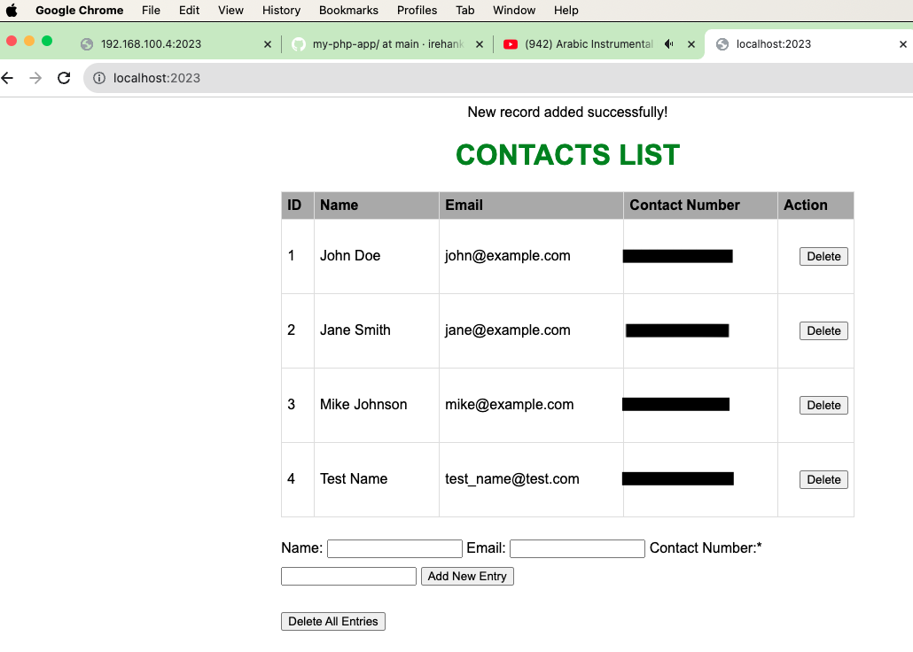

# Docker Compose

Now i will use Docker Compose tool and create a `docker-compose.yml` file which is used for defining and running multi-container Docker applications. With Compose, you use a YAML file to configure your application's services. Then, with a single command, you create and start all the services from your configuration. In our case we start our web and db service simultaneously.

```ymlAM
   version: '3.8'
   services:
     web:
      build:
          context: .
          dockerfile: Dockerfile

      container_name: php-app
      ports:
      - "2023:80"
      volumes:
      - .:/var/www/html
      - ./mysql.sql:/mysql.sql

     db:
      build:
          context: .
          dockerfile: Dockerfile-sql
   
      container_name: mysql-db
      command: --default-authentication-plugin=mysql_native_password
      restart: always
      environment:
        MYSQL_ROOT_PASSWORD: your_password
        MYSQL_DATABASE: mydatabase
      ports:
        - "3306:3306"
      volumes:
        - mysql_data:/var/lib/mysql
        - ./mysql.sql:/docker-entrypoint-initdb.d/mysql.sql

   volumes:
     mysql_data:
```
You can see in our above Docker Compose file two services are defined: web and db. The web service is for a PHP application with Apache, and the db service is for a MySQL database.

Explanation:

- Version: Specifies the version of Docker Compose syntax you are using.
- Services:
    - Web Service (web):
        - build: Specifies the build configuration for the service, including the context (current directory) and the Dockerfile to use (Dockerfile).
        - container_name: Specifies the name for the container created from this service.
        - ports: Maps port 2023 on the host to port 80 in the container.
        - volumes: Mounts two volumes:
            - Maps the current directory to /var/www/html in the container.
            - Mounts ./mysql.sql to /mysql.sql in the container.
    - DB Service (db):
        - build: Specifies the build configuration for the service, including the context (current directory) and the Dockerfile to use (Dockerfile-sql).
        - container_name: Specifies the name for the container created from this service.
        - command: Specifies the command to run when the container starts.
        - restart: Specifies that the container should always restart.
        - environment: Sets environment variables for the MySQL service, including the root password and the initial database to create.
        - ports: Maps port 3306 on the host to port 3306 in the container.
        - volumes: Mounts two volumes:
            - Maps the volume named mysql_data to /var/lib/mysql in the container.
            - Mounts ./mysql.sql to /docker-entrypoint-initdb.d/mysql.sql in the container.
- Volumes:
    - mysql_data: Defines a named volume for persisting MySQL data.

Make sure that your Dockerfile and Dockerfile-sql are correctly configured for your PHP application and MySQL database, respectively. Adjust the file paths and configurations as needed.

Before running docker-compose file we have to make some changes in index.php our main code file. Change $servername to `"db"` and $username to `"root"`. Make these changes as per your docker-compose.yml file.

```php
<?php
$servername = "192.168.100.4"; // Docker service name. 
// when running from docker compose use your db service name "db" from docker-compose file.
$username = "rehan"; // MySQL your own username. 
// username must be same used in mysql.sql file . When running from docker compose use root user.
```
After making above changes we will use below docker-compose command to run both web and db services.
```bash
docker-compose up --build
```
The command is used to build the Docker images and start the services defined in your Docker Compose file. Here's what each part of the command does:

- docker-compose: The command to work with Docker Compose.
- up: Brings up the defined services.
- --build: Builds the Docker images before starting the services.

When you run this command, Docker Compose will:

1. Build the Docker images specified in your docker-compose.yml file.
2. Create and start containers for the defined services (web and db).
3. Output logs from the containers to the console.

Make sure you are in the directory where your docker-compose.yml file is located before running this command. If there are any issues during the build or startup process, Docker Compose will display error messages in the console.

Here's how you can run it:

Remember to replace `your_password`` and configure your Dockerfiles (`Dockerfile`  and  `Dockerfile-sql`) appropriately for your PHP application and MySQL database setup.

### Logs, Test and Result
```bash
irehankhan@Rehans-Mac-mini Github_actions_db % docker-compose up --build                           
[+] Building 7.6s (16/16) FINISHED                                                  docker:desktop-linux
 => [db internal] load .dockerignore                                                                0.0s
 => => transferring context: 2B                                                                     0.0s
 => [db internal] load build definition from Dockerfile-sql                                         0.0s
 => => transferring dockerfile: 300B                                                                0.0s
 => [db internal] load metadata for docker.io/library/mysql:latest                                  0.0s
 => [db internal] load build context                                                                0.0s
 => => transferring context: 68B                                                                    0.0s
 => [db 1/2] FROM docker.io/library/mysql:latest                                                    0.0s
 => [web internal] load .dockerignore                                                               0.0s
 => => transferring context: 2B                                                                     0.0s
 => [web internal] load build definition from Dockerfile                                            0.0s
 => => transferring dockerfile: 182B                                                                0.0s
 => CACHED [db 2/2] COPY mysql.sql /docker-entrypoint-initdb.d/mysql.sql                            0.0s
 => [db] exporting to image                                                                         0.0s
 => => exporting layers                                                                             0.0s
 => => writing image sha256:268ccf002577a1bb438a1a20abf96a5b090c1094982fa25bd98aca3b91e04aba        0.0s
 => => naming to docker.io/library/github_actions_db-db                                             0.0s
 => [web internal] load metadata for docker.io/library/php:7.4-apache                               3.1s
 => [web auth] library/php:pull token for registry-1.docker.io                                      0.0s
 => [web internal] load build context                                                               0.0s
 => => transferring context: 4.92kB                                                                 0.0s
 => CACHED [web 1/3] FROM docker.io/library/php:7.4-apache@sha256:c9d7e608f73832673479770d66aacc81  0.0s
 => [web 2/3] COPY index.php /var/www/html/                                                         0.0s
 => [web 3/3] RUN docker-php-ext-install mysqli                                                     4.4s
 => [web] exporting to image                                                                        0.0s
 => => exporting layers                                                                             0.0s
 => => writing image sha256:fe5445e068cedd71ee2ed63ead7481bbc8d6aab2bd1189852049374bae65f034        0.0s
 => => naming to docker.io/library/github_actions_db-web                                            0.0s
[+] Running 3/3                                                                                          
 ✔ Network github_actions_db_default  Created                                                       0.0s 
 ✔ Container mysql-db                 Created                                                       0.0s 
 ✔ Container php-app                  Created                                                       0.0s 
Attaching to mysql-db, php-app
mysql-db  | 2023-11-17 16:59:55+00:00 [Note] [Entrypoint]: Entrypoint script for MySQL Server 8.2.0-1.el8 started.
php-app   | AH00558: apache2: Could not reliably determine the server's fully qualified domain name, using 172.18.0.3. Set the 'ServerName' directive globally to suppress this message
php-app   | AH00558: apache2: Could not reliably determine the server's fully qualified domain name, using 172.18.0.3. Set the 'ServerName' directive globally to suppress this message
php-app   | [Fri Nov 17 16:59:55.050678 2023] [mpm_prefork:notice] [pid 1] AH00163: Apache/2.4.54 (Debian) PHP/7.4.33 configured -- resuming normal operations
php-app   | [Fri Nov 17 16:59:55.050719 2023] [core:notice] [pid 1] AH00094: Command line: 'apache2 -D FOREGROUND'
mysql-db  | 2023-11-17 16:59:55+00:00 [Note] [Entrypoint]: Switching to dedicated user 'mysql'
mysql-db  | 2023-11-17 16:59:55+00:00 [Note] [Entrypoint]: Entrypoint script for MySQL Server 8.2.0-1.el8 started.
mysql-db  | '/var/lib/mysql/mysql.sock' -> '/var/run/mysqld/mysqld.sock'
mysql-db  | 2023-11-17T16:59:55.354396Z 0 [System] [MY-015015] [Server] MySQL Server - start.
mysql-db  | 2023-11-17T16:59:55.535235Z 0 [Warning] [MY-011068] [Server] The syntax '--skip-host-cache' is deprecated and will be removed in a future release. Please use SET GLOBAL host_cache_size=0 instead.
mysql-db  | 2023-11-17T16:59:55.536208Z 0 [Warning] [MY-010918] [Server] 'default_authentication_plugin' is deprecated and will be removed in a future release. Please use authentication_policy instead.
mysql-db  | 2023-11-17T16:59:55.536221Z 0 [System] [MY-010116] [Server] /usr/sbin/mysqld (mysqld 8.2.0) starting as process 1
mysql-db  | 2023-11-17T16:59:55.544603Z 1 [System] [MY-013576] [InnoDB] InnoDB initialization has started.
mysql-db  | 2023-11-17T16:59:55.643976Z 1 [System] [MY-013577] [InnoDB] InnoDB initialization has ended.
mysql-db  | 2023-11-17T16:59:55.748173Z 0 [Warning] [MY-010068] [Server] CA certificate ca.pem is self signed.
mysql-db  | 2023-11-17T16:59:55.748193Z 0 [System] [MY-013602] [Server] Channel mysql_main configured to support TLS. Encrypted connections are now supported for this channel.
mysql-db  | 2023-11-17T16:59:55.749051Z 0 [Warning] [MY-011810] [Server] Insecure configuration for --pid-file: Location '/var/run/mysqld' in the path is accessible to all OS users. Consider choosing a different directory.
mysql-db  | 2023-11-17T16:59:55.763842Z 0 [System] [MY-011323] [Server] X Plugin ready for connections. Bind-address: '::' port: 33060, socket: /var/run/mysqld/mysqlx.sock
mysql-db  | 2023-11-17T16:59:55.764171Z 0 [System] [MY-010931] [Server] /usr/sbin/mysqld: ready for connections. Version: '8.2.0'  socket: '/var/run/mysqld/mysqld.sock'  port: 3306  MySQL Community Server - GPL.
```
For Testing use below link/s in your browser.
```links
http://localhost:2023/ or
http://192.168.100.4:2023/
```
Result

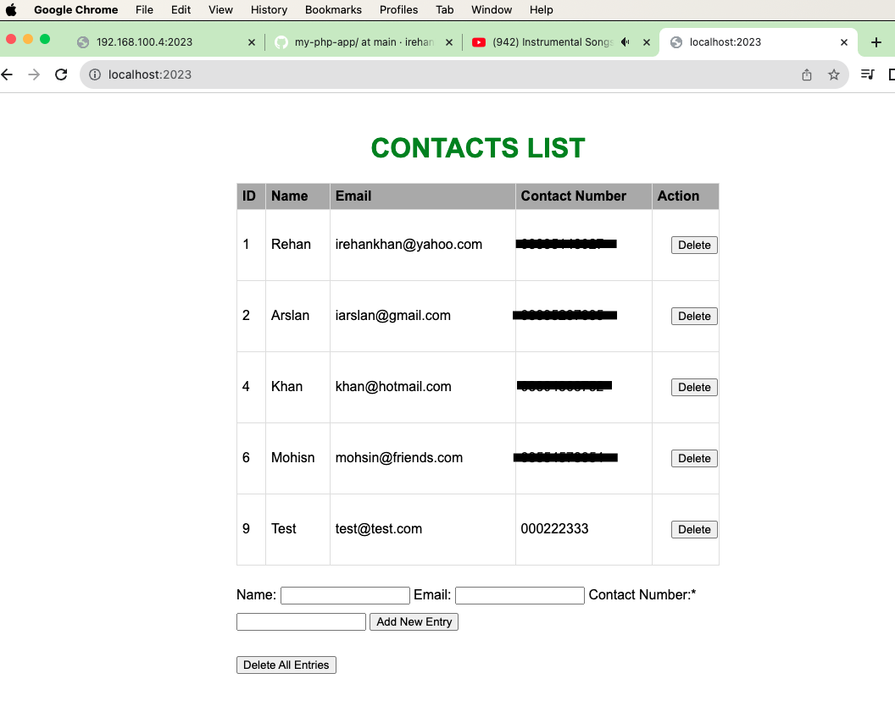

# Github Actions CI/CD pipelines and Deploy to Docker Hub


GitHub Actions makes it easy to automate all your software workflows, now with CI/CD. Build, test, and deploy your code right from GitHub. Make code reviews, branch management, and issue trigging work the way you want. Now we will create a github actions workflow file on path `.github/workflow/main.yml` with name `main.yml`

```yaml
name: Docker Build and Push

on:
  push:
    branches:
      - main

jobs:
  build:
    runs-on: ubuntu-latest
    steps:
      - name: Checkout code
        uses: actions/checkout@v3

  test:
    runs-on: ubuntu-latest
    needs: build
    steps:
      - name: Checkout code
        uses: actions/checkout@v3

      - name: Check PHP syntax
        run: |
          echo "Testing PHP index.php code"
          php -l index.php

  deploy:
    runs-on: ubuntu-latest
    needs: test
    steps:
      - name: Checkout Repository
        uses: actions/checkout@v3

      - name: Set up QEMU
        uses: docker/setup-qemu-action@v2
        
      - name: Set up Docker Buildx
        uses: docker/setup-buildx-action@v2

      - name: Login to Docker Hub
        uses: docker/login-action@v1
        with:
          username: ${{ secrets.DOCKERHUB_USERNAME }}
          password: ${{ secrets.DOCKERHUB_TOKEN }}

      - name: Build and Push Docker Image
        uses: docker/build-push-action@v2
        with:
          context: .
          platforms: linux/amd64,linux/arm64
          push: true
          tags: irehankhan/my-php-app:1.0
```
## Workflow file Explanation:

Our GitHub Actions workflow file have three jobs: build, test, and deploy. This workflow triggers on pushes to the main branch.

### Job 1: build
- Purpose: This job checks out the code from the repository.
### Job 2: test
- Purpose: This job checks the PHP syntax of the index.php file.
- Dependencies: Depends on the successful completion of the build job.
### Job 3: deploy
- Purpose: This job sets up QEMU, Docker Buildx, and deploys the Docker image to Docker Hub.
- Dependencies: Depends on the successful completion of the test job.
### Workflow Configuration:
- Trigger: The workflow is triggered on pushes to the main branch.
### Docker Build and Push Job (deploy):
- Docker Setup:
    - Uses QEMU and Docker Buildx to enable multi-platform builds.
- Login to Docker Hub:
    - Uses Docker Login Action to log in to Docker Hub using Docker Hub credentials stored as secrets.
- Build and Push Docker Image:
    - Uses Docker Build and Push Action to build and push the Docker image.
    - Sets the build context to the current directory (.).
    - Specifies the target platforms as linux/amd64 and linux/arm64.
    - Pushes the image to Docker Hub with the tag irehankhan/my-php-app:1.0.

### Environment variables to store sensitive data

Ensure that you have set up the necessary Docker Hub secrets (DOCKERHUB_USERNAME and DOCKERHUB_TOKEN) in your GitHub repository from you repo settings.

- Here are the steps to set up these secrets:

    1. Docker Hub Account:
        - Make sure you have a Docker Hub account.
        - If you don't have one, you can sign up at Docker Hub.
    2. GitHub Repository:
        - Go to your GitHub repository where the workflow is defined.
    3. Settings:
        - Click on the "Settings" tab in your GitHub repository.
    4. Secrets:
        - In the left sidebar, click on "Secrets" under "Settings."
    5. Add Secrets:
        - Click on the "New repository secret" button.
    6. Add DOCKERHUB_USERNAME:
        - Name: DOCKERHUB_USERNAME
        - Value: Your Docker Hub username.
    7. Add DOCKERHUB_TOKEN:
        - Name: DOCKERHUB_TOKEN
        - Value: Your Docker Hub access token.
        - Note: To create a Docker Hub access token, go to Docker Hub > Account Settings > Security > New Access Token. Provide a name and set the required permissions (write access for pushing images). Copy the generated token and use it as the secret value.
    8. Save Secrets:
        - Click on the "Add secret" button to save each secret.

Now, your GitHub Actions workflow can access these secrets during the build and push steps.

Remember that secrets are encrypted and only exposed to the workflow runs, making them a secure way to handle sensitive information in your CI/CD pipeline.

Please make sure to replace irehankhan/my-php-app:1.0 with the appropriate repository and tag for your Docker image. Also, adapt the workflow according to your specific project requirements.

## Pipeline Testing

Now lastly configure git in your local directory and create repo on github. Then push your local project directory to your github repo main branch it will trigger workflow.

### git logs
```bash
irehankhan@Rehans-Mac-mini Github_actions_db % git status
On branch main
Your branch is up to date with 'origin/main'.

Changes not staged for commit:
  (use "git add <file>..." to update what will be committed)
  (use "git restore <file>..." to discard changes in working directory)
	modified:   README.md
	modified:   index.php

Untracked files:
  (use "git add <file>..." to include in what will be committed)
	image-1.png
	image-2.png
	image-3.png
	image.png

no changes added to commit (use "git add" and/or "git commit -a")
irehankhan@Rehans-Mac-mini Github_actions_db % git add .
irehankhan@Rehans-Mac-mini Github_actions_db % git commit -m "FINAL COMMIT"
[main 1807e4b] FINAL COMMIT
 6 files changed, 691 insertions(+), 3 deletions(-)
 create mode 100644 image-1.png
 create mode 100644 image-2.png
 create mode 100644 image-3.png
 create mode 100644 image.png
irehankhan@Rehans-Mac-mini Github_actions_db % git push -u origin main                             
Enumerating objects: 11, done.
Counting objects: 100% (11/11), done.
Delta compression using up to 8 threads
Compressing objects: 100% (8/8), done.
Writing objects: 100% (8/8), 1.51 MiB | 1.11 MiB/s, done.
Total 8 (delta 1), reused 0 (delta 0), pack-reused 0
remote: Resolving deltas: 100% (1/1), completed with 1 local object.
remote: Bypassed rule violations for refs/heads/main:
remote: 
remote: - Changes must be made through a pull request.
remote: 
To github.com:irehankhan/my-php-app.git
   3842abf..1807e4b  main -> main
branch 'main' set up to track 'origin/main'.
```

The workflow we use set's up to be triggered automatically on each push to the main branch. Here's the relevant part of the workflow file:

```yaml
on:
  push:
    branches:
      - main
```
Our configuration specifies that the workflow should be triggered on each push to the main branch. It listens for changes in the specified branch, and when a new commit is pushed, the workflow is automatically triggered.

Make sure to adjust the trigger conditions based on your project's requirements and branching strategy.

For checking github actions

1. Navigate to Your Repository:
    - Open the GitHub repository where your Actions workflow is defined.
2. Go to Actions:
Click on the "Actions" tab at the top of the repository.
3. Select Workflow:
From the list of workflows, select the workflow you want to check. 
4. Monitor Workflow Run:
    - Once triggered, you can monitor the progress of the workflow run on the same "Actions" page. GitHub will display the steps and logs as the workflow progresses.

### Workflow logs.

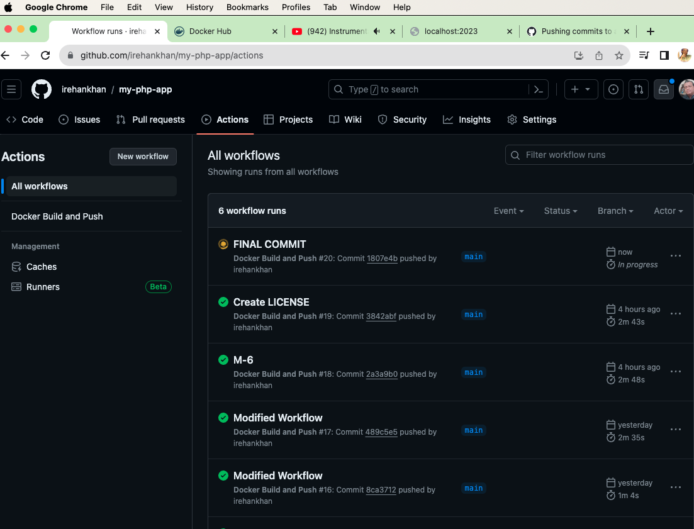

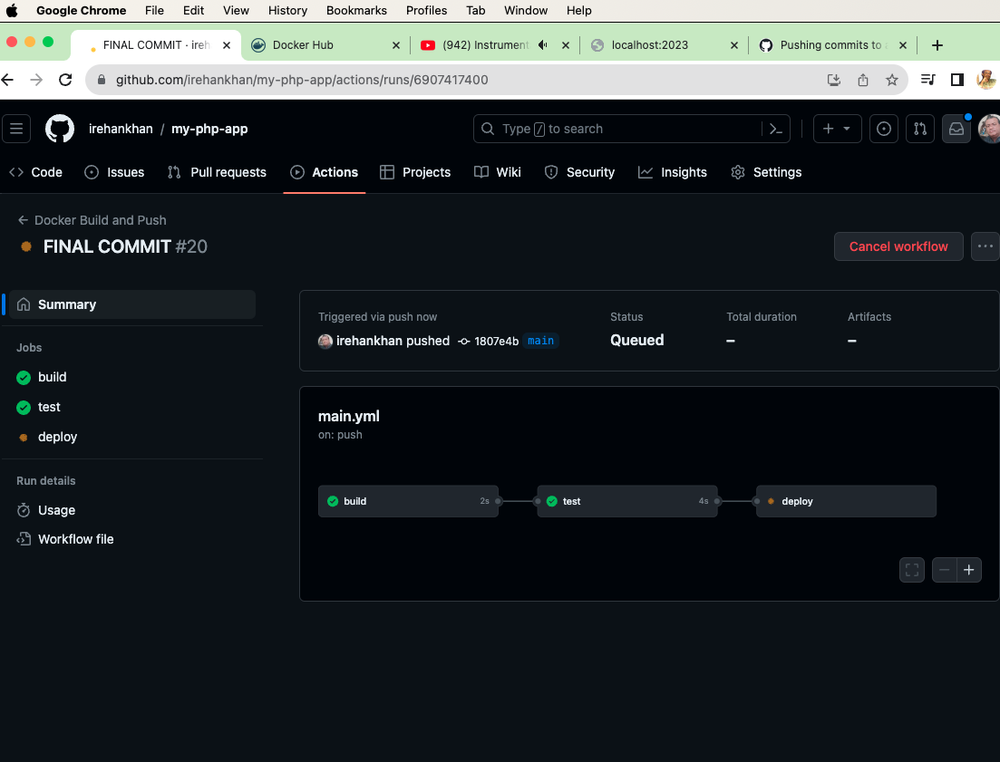

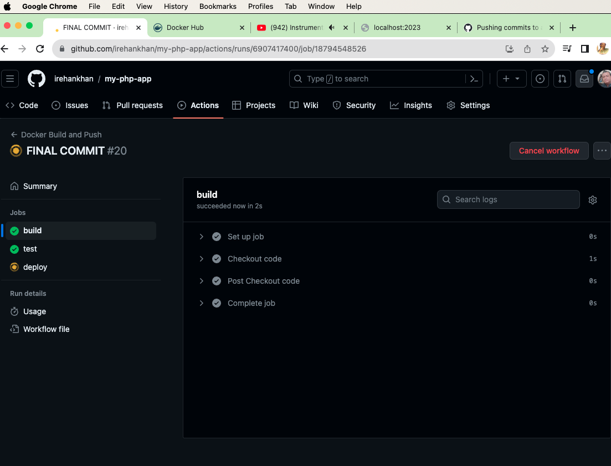

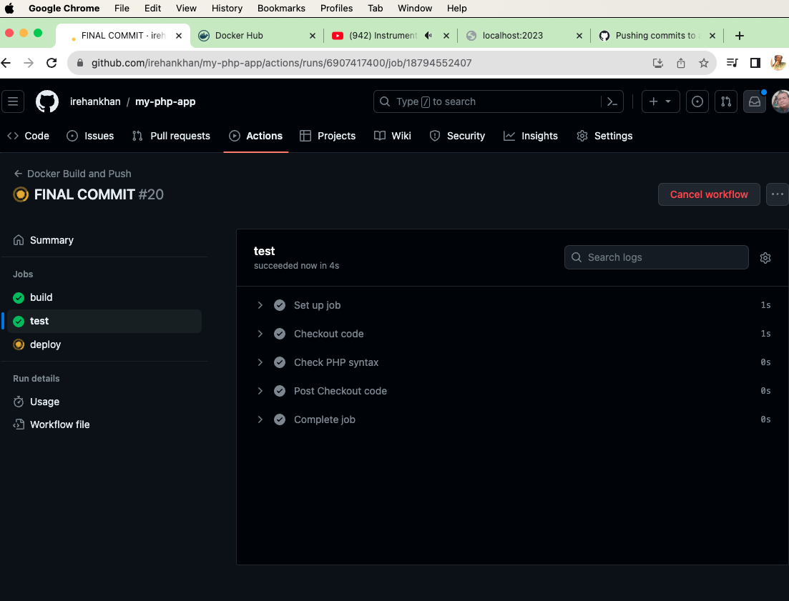

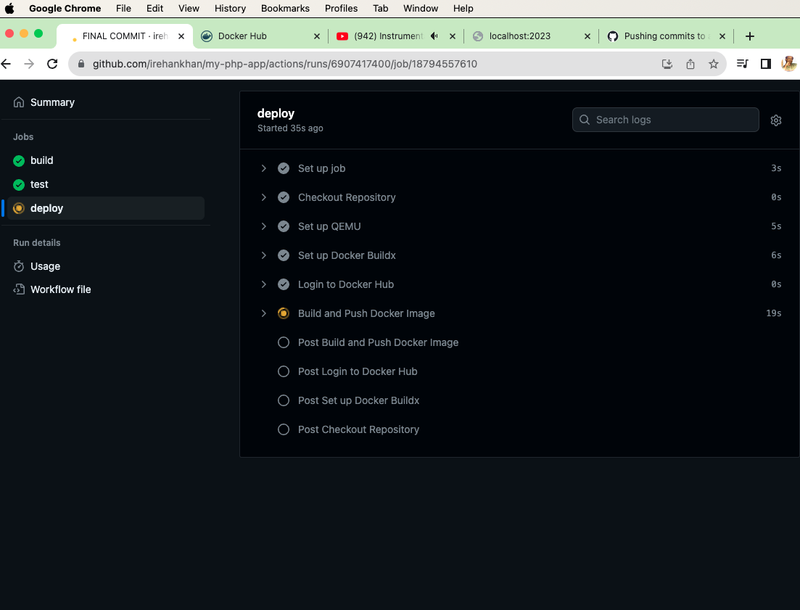

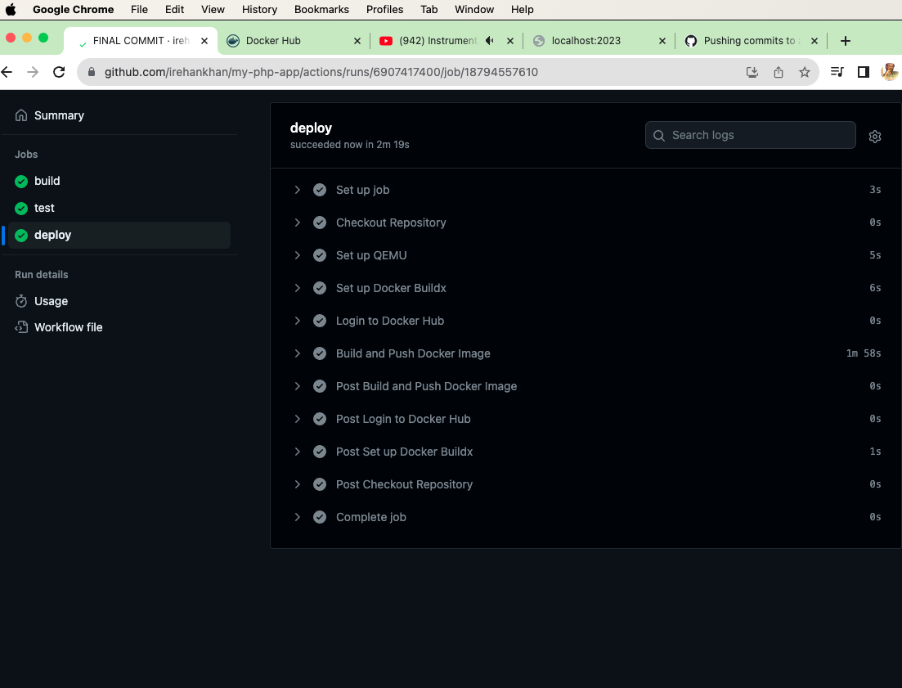

## Docker Hub Deploy

Image pushed to docker hub

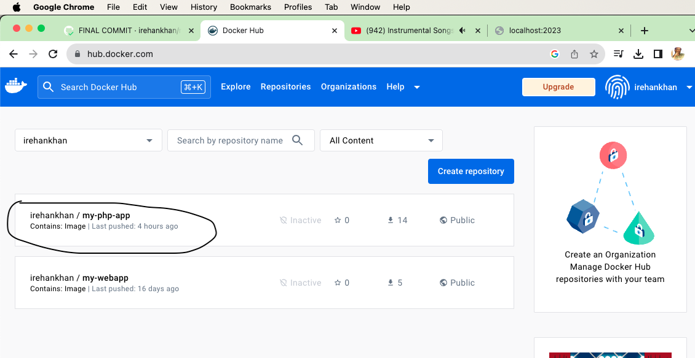

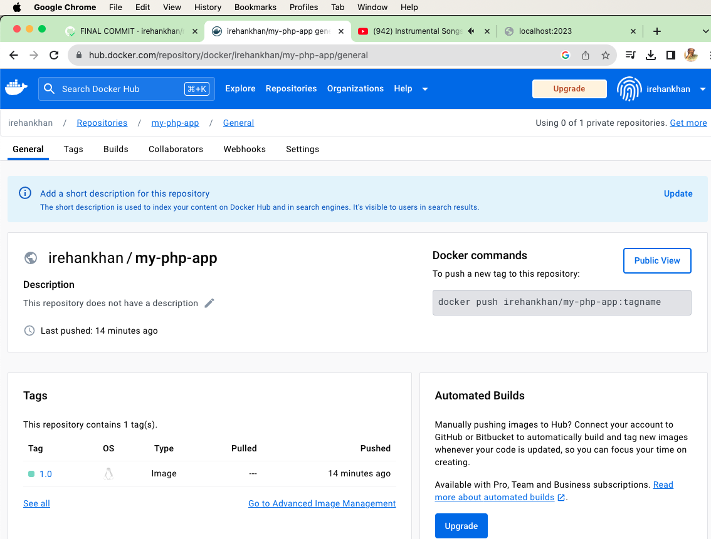


<h1>Thank You! </h1>